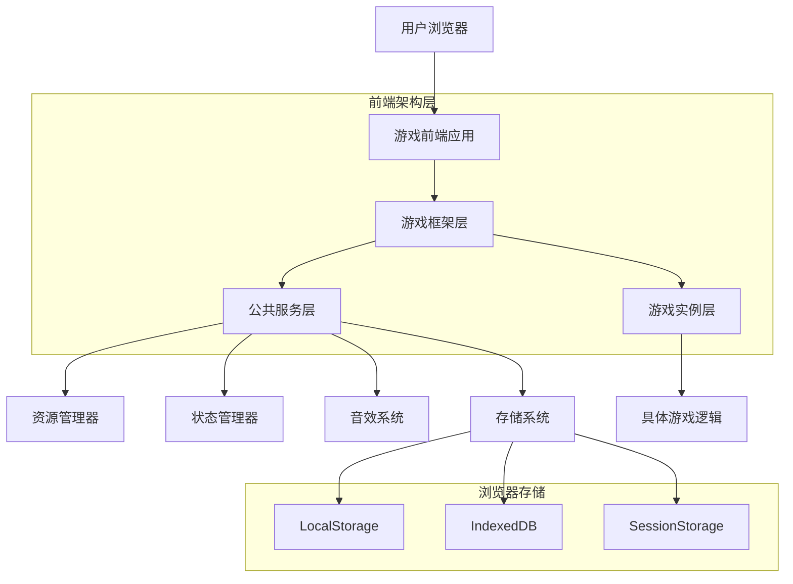
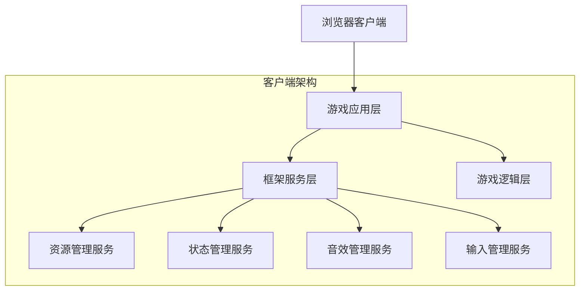
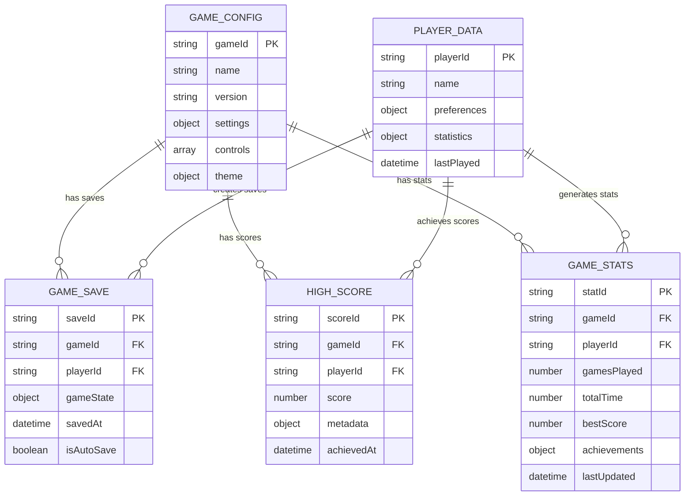

# 游戏库优化技术架构文档

## 1. 架构设计



## 2. 技术描述

- 前端：HTML5 + CSS3 + Vanilla JavaScript (ES6+)
- 存储：LocalStorage + IndexedDB + SessionStorage
- 音频：Web Audio API + HTML5 Audio
- 图形：Canvas 2D API + CSS3 Animations
- 构建：无构建工具（原生JavaScript模块化）

## 3. 路由定义

| 路由 | 用途 |
|------|------|
| /index.html | 主页面，显示游戏列表和导航 |
| /snake.html | 贪吃蛇游戏页面 |
| /tetris.html | 俄罗斯方块游戏页面 |
| /2048.html | 2048数字游戏页面 |
| /memory-game.html | 记忆翻牌游戏页面 |
| /tic-tac-toe.html | 井字棋游戏页面 |
| /minesweeper.html | 扫雷游戏页面 |
| /brick-breaker.html | 打砖块游戏页面 |
| /sudoku.html | 数独游戏页面 |
| /flappy-bird.html | Flappy Bird游戏页面 |
| /hangman.html | 猜单词游戏页面 |
| /sliding-puzzle.html | 数字华容道游戏页面 |
| /plane-combat.html | 飞机大战游戏页面 |
| /space-shooter.html | 太空射击游戏页面 |
| /gomoku.html | 五子棋游戏页面 |
| /time-guardian.html | 时空守护者游戏页面 |

## 4. API定义

### 4.1 核心游戏框架API

#### 游戏生命周期管理
```javascript
// 游戏基类接口
class GameBase {
    constructor(canvas, options = {}) {
        this.canvas = canvas;
        this.ctx = canvas.getContext('2d');
        this.options = options;
        this.lifecycle = new GameLifecycle();
        this.state = 'stopped'; // stopped, running, paused, ended
    }
    
    // 游戏初始化
    init() { /* 子类实现 */ }
    
    // 游戏开始
    start() { /* 子类实现 */ }
    
    // 游戏暂停
    pause() { /* 子类实现 */ }
    
    // 游戏恢复
    resume() { /* 子类实现 */ }
    
    // 游戏结束
    end() { /* 子类实现 */ }
    
    // 游戏重置
    reset() { /* 子类实现 */ }
    
    // 游戏更新
    update(deltaTime) { /* 子类实现 */ }
    
    // 游戏渲染
    render() { /* 子类实现 */ }
    
    // 资源清理
    cleanup() {
        this.lifecycle.cleanup();
    }
}
```

#### 资源管理API
```javascript
// 资源加载器
class ResourceLoader {
    static async loadImage(url) {
        // 返回Promise<HTMLImageElement>
    }
    
    static async loadAudio(url) {
        // 返回Promise<HTMLAudioElement>
    }
    
    static async loadJSON(url) {
        // 返回Promise<Object>
    }
    
    static preloadResources(resourceList) {
        // 批量预加载资源
        // 返回Promise<Map<string, any>>
    }
}
```

#### 状态管理API
```javascript
// 游戏状态管理
class GameStateManager {
    static saveGameData(gameId, data) {
        // 保存游戏数据到LocalStorage
    }
    
    static loadGameData(gameId) {
        // 从LocalStorage加载游戏数据
        // 返回Object | null
    }
    
    static saveHighScore(gameId, score, playerName = 'Anonymous') {
        // 保存高分记录
    }
    
    static getHighScores(gameId, limit = 10) {
        // 获取高分榜
        // 返回Array<{score: number, name: string, date: string}>
    }
    
    static updateGameStats(gameId, stats) {
        // 更新游戏统计信息
    }
    
    static getGameStats(gameId) {
        // 获取游戏统计信息
        // 返回Object
    }
}
```

#### 音效系统API
```javascript
// 音效管理器
class AudioManager {
    static init() {
        // 初始化音效系统
    }
    
    static loadSound(id, url) {
        // 加载音效文件
        // 返回Promise<void>
    }
    
    static playSound(id, volume = 1.0, loop = false) {
        // 播放音效
    }
    
    static stopSound(id) {
        // 停止音效
    }
    
    static setMasterVolume(volume) {
        // 设置主音量
    }
    
    static setMuted(muted) {
        // 设置静音状态
    }
}
```

### 4.2 工具类API

#### 数学工具
```javascript
const MathUtils = {
    // 随机数生成
    random(min, max) { /* 返回min到max之间的随机数 */ },
    randomInt(min, max) { /* 返回min到max之间的随机整数 */ },
    
    // 角度转换
    degToRad(degrees) { /* 角度转弧度 */ },
    radToDeg(radians) { /* 弧度转角度 */ },
    
    // 距离计算
    distance(x1, y1, x2, y2) { /* 计算两点距离 */ },
    
    // 插值函数
    lerp(start, end, t) { /* 线性插值 */ },
    easeInOut(t) { /* 缓动函数 */ }
};
```

#### 碰撞检测工具
```javascript
const CollisionUtils = {
    // 矩形碰撞
    rectRect(rect1, rect2) {
        // 返回boolean
    },
    
    // 圆形碰撞
    circleCircle(circle1, circle2) {
        // 返回boolean
    },
    
    // 点与矩形碰撞
    pointRect(point, rect) {
        // 返回boolean
    },
    
    // 点与圆形碰撞
    pointCircle(point, circle) {
        // 返回boolean
    }
};
```

#### 渲染工具
```javascript
const RenderUtils = {
    // 绘制圆角矩形
    drawRoundedRect(ctx, x, y, width, height, radius) {
        // 绘制圆角矩形
    },
    
    // 绘制渐变文字
    drawGradientText(ctx, text, x, y, gradient) {
        // 绘制渐变文字
    },
    
    // 绘制阴影
    drawWithShadow(ctx, drawFunction, shadowOptions) {
        // 带阴影绘制
    },
    
    // 粒子效果
    createParticleSystem(options) {
        // 创建粒子系统
        // 返回ParticleSystem实例
    }
};
```

## 5. 服务器架构图

由于这是纯前端项目，不涉及服务器端架构。所有数据存储和处理都在客户端完成。



## 6. 数据模型

### 6.1 数据模型定义



### 6.2 数据定义语言

由于使用浏览器本地存储，以下是数据结构定义：

#### 游戏配置数据结构
```javascript
// LocalStorage Key: `game_config_${gameId}`
const gameConfig = {
    gameId: 'snake',
    name: '贪吃蛇',
    version: '1.0.0',
    settings: {
        difficulty: 'medium', // easy, medium, hard
        soundEnabled: true,
        musicEnabled: true,
        theme: 'default' // default, dark, colorful
    },
    controls: [
        { key: 'ArrowUp', action: 'moveUp' },
        { key: 'ArrowDown', action: 'moveDown' },
        { key: 'ArrowLeft', action: 'moveLeft' },
        { key: 'ArrowRight', action: 'moveRight' },
        { key: 'Space', action: 'pause' }
    ],
    theme: {
        primaryColor: '#4CAF50',
        secondaryColor: '#FFC107',
        backgroundColor: '#1a1a1a',
        textColor: '#ffffff'
    }
};
```

#### 玩家数据结构
```javascript
// LocalStorage Key: `player_data`
const playerData = {
    playerId: 'player_' + Date.now(),
    name: 'Anonymous',
    preferences: {
        language: 'zh-CN',
        theme: 'default',
        soundVolume: 0.8,
        musicVolume: 0.6,
        showTutorials: true
    },
    statistics: {
        totalGamesPlayed: 0,
        totalPlayTime: 0, // 毫秒
        favoriteGame: null,
        achievementsUnlocked: []
    },
    lastPlayed: new Date().toISOString()
};
```

#### 游戏存档结构
```javascript
// LocalStorage Key: `game_save_${gameId}_${saveId}`
const gameSave = {
    saveId: 'save_' + Date.now(),
    gameId: 'snake',
    playerId: 'player_123',
    gameState: {
        level: 5,
        score: 1250,
        lives: 3,
        // 游戏特定状态数据
        snake: {
            body: [{x: 10, y: 10}, {x: 9, y: 10}],
            direction: 'right',
            length: 2
        },
        food: {x: 15, y: 8},
        powerUps: []
    },
    savedAt: new Date().toISOString(),
    isAutoSave: false
};
```

#### 高分记录结构
```javascript
// LocalStorage Key: `high_scores_${gameId}`
const highScores = [
    {
        scoreId: 'score_' + Date.now(),
        gameId: 'snake',
        playerId: 'player_123',
        score: 2500,
        metadata: {
            level: 8,
            difficulty: 'hard',
            playTime: 180000, // 毫秒
            specialAchievements: ['no_walls_hit', 'speed_demon']
        },
        achievedAt: new Date().toISOString()
    }
    // ... 更多记录
];
```

#### 游戏统计结构
```javascript
// LocalStorage Key: `game_stats_${gameId}`
const gameStats = {
    statId: 'stats_' + Date.now(),
    gameId: 'snake',
    playerId: 'player_123',
    gamesPlayed: 25,
    totalTime: 3600000, // 毫秒
    bestScore: 2500,
    averageScore: 1200,
    achievements: {
        firstWin: { unlocked: true, unlockedAt: '2024-01-01T00:00:00Z' },
        speedDemon: { unlocked: false, progress: 0.7 },
        perfectGame: { unlocked: false, progress: 0.0 }
    },
    streaks: {
        currentWinStreak: 3,
        longestWinStreak: 7,
        currentPlayStreak: 5 // 连续游玩天数
    },
    lastUpdated: new Date().toISOString()
};
```

#### IndexedDB数据库结构（用于大量数据存储）
```javascript
// 数据库名称: GameLibraryDB
// 版本: 1

// 对象存储: gameReplays
const gameReplay = {
    id: 'replay_' + Date.now(),
    gameId: 'snake',
    playerId: 'player_123',
    score: 2500,
    duration: 180000,
    actions: [
        { timestamp: 0, action: 'start' },
        { timestamp: 1000, action: 'moveUp' },
        { timestamp: 2000, action: 'moveRight' },
        // ... 更多操作记录
    ],
    recordedAt: new Date().toISOString()
};

// 对象存储: gameAssets
const gameAsset = {
    id: 'asset_snake_sprites',
    gameId: 'snake',
    type: 'image', // image, audio, json
    url: './assets/snake/sprites.png',
    data: null, // Blob数据
    size: 15360, // 字节
    cachedAt: new Date().toISOString(),
    expiresAt: new Date(Date.now() + 7 * 24 * 60 * 60 * 1000).toISOString() // 7天后过期
};
```

#### 初始化数据脚本
```javascript
// 初始化默认数据
function initializeGameData() {
    // 检查是否已初始化
    if (!localStorage.getItem('game_library_initialized')) {
        // 创建默认玩家数据
        const defaultPlayer = {
            playerId: 'player_' + Date.now(),
            name: 'Anonymous',
            preferences: {
                language: 'zh-CN',
                theme: 'default',
                soundVolume: 0.8,
                musicVolume: 0.6,
                showTutorials: true
            },
            statistics: {
                totalGamesPlayed: 0,
                totalPlayTime: 0,
                favoriteGame: null,
                achievementsUnlocked: []
            },
            lastPlayed: new Date().toISOString()
        };
        
        localStorage.setItem('player_data', JSON.stringify(defaultPlayer));
        
        // 为每个游戏创建默认配置
        const games = ['snake', 'tetris', '2048', 'memory-game', 'tic-tac-toe'];
        games.forEach(gameId => {
            const defaultConfig = {
                gameId,
                settings: {
                    difficulty: 'medium',
                    soundEnabled: true,
                    musicEnabled: true,
                    theme: 'default'
                }
            };
            localStorage.setItem(`game_config_${gameId}`, JSON.stringify(defaultConfig));
            
            // 初始化空的高分榜
            localStorage.setItem(`high_scores_${gameId}`, JSON.stringify([]));
        });
        
        // 标记已初始化
        localStorage.setItem('game_library_initialized', 'true');
        localStorage.setItem('game_library_version', '1.0.0');
    }
}

// 页面加载时初始化
document.addEventListener('DOMContentLoaded', initializeGameData);
```

## 7. 性能优化架构

### 7.1 资源加载优化
```javascript
// 资源加载优先级管理
class ResourcePriorityLoader {
    constructor() {
        this.queues = {
            critical: [], // 游戏核心资源
            high: [],     // 重要UI资源
            normal: [],   // 一般资源
            low: []       // 可选资源
        };
        this.maxConcurrent = 4;
        this.loading = new Set();
    }
    
    addResource(url, priority = 'normal', type = 'auto') {
        this.queues[priority].push({ url, type });
    }
    
    async loadAll() {
        // 按优先级顺序加载资源
        for (const priority of ['critical', 'high', 'normal', 'low']) {
            await this.loadQueue(this.queues[priority]);
        }
    }
}
```

### 7.2 渲染性能优化
```javascript
// 渲染优化管理器
class RenderOptimizer {
    constructor(canvas) {
        this.canvas = canvas;
        this.ctx = canvas.getContext('2d');
        this.dirtyRegions = [];
        this.lastFrameTime = 0;
        this.targetFPS = 60;
        this.frameTimeThreshold = 1000 / this.targetFPS;
    }
    
    // 脏区域渲染
    addDirtyRegion(x, y, width, height) {
        this.dirtyRegions.push({ x, y, width, height });
    }
    
    // 智能渲染调度
    scheduleRender(renderFunction) {
        const now = performance.now();
        if (now - this.lastFrameTime >= this.frameTimeThreshold) {
            this.performRender(renderFunction);
            this.lastFrameTime = now;
        } else {
            requestAnimationFrame(() => this.scheduleRender(renderFunction));
        }
    }
}
```

### 7.3 内存管理优化
```javascript
// 内存池管理
class ObjectPool {
    constructor(createFn, resetFn, initialSize = 10) {
        this.createFn = createFn;
        this.resetFn = resetFn;
        this.pool = [];
        this.active = new Set();
        
        // 预创建对象
        for (let i = 0; i < initialSize; i++) {
            this.pool.push(this.createFn());
        }
    }
    
    acquire() {
        let obj = this.pool.pop();
        if (!obj) {
            obj = this.createFn();
        }
        this.active.add(obj);
        return obj;
    }
    
    release(obj) {
        if (this.active.has(obj)) {
            this.active.delete(obj);
            this.resetFn(obj);
            this.pool.push(obj);
        }
    }
    
    cleanup() {
        this.active.clear();
        this.pool.length = 0;
    }
}
```

这个技术架构文档详细描述了游戏库优化的技术实现方案，包括完整的API设计、数据模型定义和性能优化策略，为开发团队提供了清晰的技术指导。