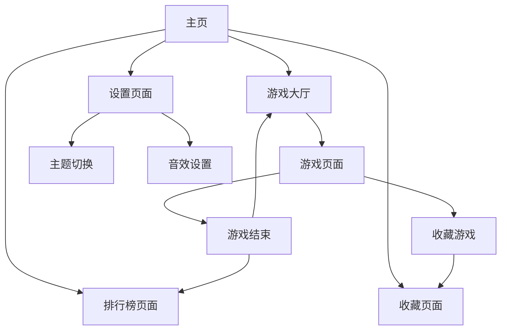

# 小游戏平台扩展需求文档

## 1. 产品概述

将现有的16个小游戏平台扩展至至少50个游戏，并全面提升视觉设计和用户体验。

* 目标：打造一个功能丰富、视觉精美的综合性小游戏平台，满足不同年龄段用户的娱乐需求。

* 市场价值：成为用户首选的在线游戏娱乐平台，提供多样化的游戏体验。

## 2. 核心功能

### 2.1 用户角色

| 角色   | 注册方式      | 核心权限                 |
| ---- | --------- | -------------------- |
| 普通用户 | 无需注册，直接访问 | 可游玩所有游戏，查看排行榜，保存游戏记录 |
| 高级用户 | 本地存储升级    | 可自定义主题，保存游戏进度，查看详细统计 |

### 2.2 功能模块

我们的游戏平台包含以下主要页面：

1. **主页**：游戏分类导航、热门游戏推荐、搜索功能、用户统计面板
2. **游戏大厅**：分类筛选、游戏卡片展示、收藏功能、最近游玩记录
3. **游戏页面**：游戏界面、控制说明、暂停菜单、分享功能
4. **排行榜页面**：全球排行、个人最佳、游戏统计、成就系统
5. **设置页面**：主题切换、音效设置、控制配置、数据管理
6. **关于页面**：游戏介绍、开发信息、更新日志、反馈入口
7. **收藏页面**：个人收藏游戏、快速访问、分类管理

### 2.3 页面详情

| 页面名称  | 模块名称 | 功能描述                     |
| ----- | ---- | ------------------------ |
| 主页    | 导航栏  | 显示游戏分类、搜索框、设置入口          |
| 主页    | 轮播横幅 | 展示热门游戏、新游戏推荐、活动信息        |
| 主页    | 快速入口 | 最近游玩、收藏游戏、随机游戏按钮         |
| 主页    | 统计面板 | 显示总游戏数、今日游玩时间、个人最佳分数     |
| 游戏大厅  | 分类筛选 | 按类型筛选（益智、动作、策略、经典、休闲、竞技） |
| 游戏大厅  | 游戏网格 | 展示游戏卡片，包含缩略图、标题、难度、评分    |
| 游戏大厅  | 搜索排序 | 按名称搜索、按热度/难度/时间排序        |
| 游戏页面  | 游戏容器 | 嵌入游戏界面，全屏支持，响应式布局        |
| 游戏页面  | 控制面板 | 暂停/继续、重新开始、返回大厅、设置       |
| 游戏页面  | 信息显示 | 当前分数、最佳分数、游戏时间、操作提示      |
| 排行榜页面 | 排行列表 | 显示各游戏排行榜，支持切换时间范围        |
| 排行榜页面 | 个人统计 | 个人各游戏最佳成绩、总游玩时间、成就进度     |
| 设置页面  | 主题设置 | 切换深色/浅色主题、自定义配色方案        |
| 设置页面  | 音效设置 | 调节音效音量、背景音乐、音效开关         |
| 设置页面  | 控制设置 | 自定义按键映射、触控灵敏度、手势设置       |
| 收藏页面  | 收藏列表 | 显示收藏的游戏，支持分类和排序          |
| 收藏页面  | 快速启动 | 一键启动收藏游戏，批量管理功能          |

## 3. 核心流程

**主要用户操作流程：**
用户访问主页 → 浏览游戏分类或搜索 → 选择感兴趣的游戏 → 进入游戏页面 → 开始游戏 → 查看分数排行榜 → 收藏喜欢的游戏 → 返回继续探索其他游戏

**游戏管理流程：**
管理员添加新游戏 → 配置游戏信息和分类 → 测试游戏功能 → 发布到游戏大厅 → 监控游戏数据 → 根据反馈优化

## 4. 用户界面设计

### 4.1 设计风格

* **主色调**：深蓝色 (#1a237e) 和亮蓝色 (#3f51b5)，辅助色为橙色 (#ff9800) 和绿色 (#4caf50)

* **按钮样式**：圆角矩形，渐变背景，悬停动画效果

* **字体**：主标题使用 'Orbitron' 科技感字体，正文使用 'Roboto' 清晰易读字体，中文使用微

